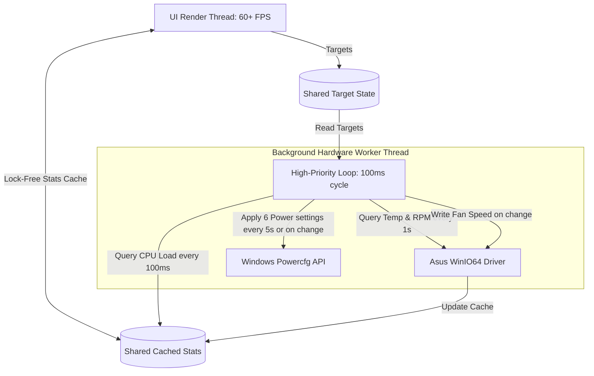

# 🚀 Asus Fan & CPU Controller Pro (Bloat-Free Ultimate Edition)

An ultra-lightweight, high-performance, and **completely bloat-free** hardware utility designed specifically for **Asus Vivobook, ZenBook, ROG, TUF, and Zenbook** laptops. It replaces heavy OEM software (Armoury Crate, MyASUS, G-Helper) and aggregates dynamic fan speed mapping with hardware-level CPU frequency unlocking (ThrottleStop wrappers) into a single standalone, self-healing executable.

Unlike other software, this utility is engineered from the ground up to utilize **zero background CPU/RAM overhead**, bypassing Windows User Account Control (UAC) prompts automatically and silently on startup.

---

## 🌟 Why This Program? (The Bloat-Free Advantage)

Standard ASUS utility programs (like Armoury Crate or MyASUS) run dozens of background telemetry services, eat hundreds of megabytes of RAM, and cause high system DPC latency. 

On the other hand, traditional tuning tools (like ThrottleStop or SpeedFan) require complex manual setups, prompt you with annoying UAC warnings at every boot, and do not combine both CPU frequency limits and custom motherboard fan curve controls under one roof.

**Asus Fan & CPU Controller Pro** solves all of this:
1. **Dynamic Fan Mapping**: Binds directly to the native ASUSTek Kernel Driver (`AsusWinIO64.dll`) to capture exact motherboard thermals and adjust fan RPMs in real-time.
2. **Dynamic CPU Frequency Sync**: Configures Windows CPPC/EPP values, disables core idle C-states, toggles Intel Turbo Boost, and wraps **ThrottleStop** silently to unlock physical hardware PL1 power limits.
3. **60+ FPS Dragging Fluidity**: Decouples slow, blocking hardware sensor queries onto a high-priority background thread, keeping the GUI incredibly smooth and completely lag-free.
4. **Autonomous Self-Healing**: Automatically registers a UAC-bypassing startup task and generates desktop shortcuts dynamically on launch. Just copy-paste the folder and run it once as Administrator!
5. **Keyboard Backlight Controller**: Bundles a clean, standalone AutoHotkey v2 script (`AsusKeyboardBacklightController.ahk`) that calls the Asus WMI interface to cycle through keyboard backlight brightness levels (High -> Med -> Low -> Off) silently via a global hotkey, completely free of bloated background services.

---

## ⚡ CPU Frequency & Power Throttling: The Technical Blueprint

Gaming and high-load tasks on laptops frequently trigger aggressive thermal throttling or lock CPU speeds to baseline frequencies (e.g. 1.0–1.3 GHz). We implemented a comprehensive, automated control scheme using six deep registry/power settings:

| Power Setting | GUID | Max Performance Value | Hard Cap Mode (e.g. 2.8 GHz) | Description |
|---|---|---|---|---|
| **PROCFREQMAX** | `75b0ae3f-bce0-45a7-8c89-c9611c25e100` | `0` (Unlimited) | `2800` (2800 MHz) | Direct frequency ceiling in Megahertz. |
| **PROCTHROTTLEMAX** | `bc5038f7-23e0-4960-96da-33abaf5935ec` | `100` (%) | `100` (%) | Avoids OS throttling overrides under load. |
| **PROCTHROTTLEMIN** | `893dee8e-2bef-41e0-89c6-b55d0929964c` | `100` (%) | `5` (%) | Forces core responsiveness in Max Mode. |
| **PERFBOOSTMODE** | `be337238-0d82-4146-a960-4f3749d470c7` | `2` (Aggressive) | `0` (Disabled) | Controls Intel Turbo Boost behavior. Off lowers temps by 15–20°C in cap mode! |
| **PERFEPP** | `36687f9e-e3a5-4dbf-b1dc-15eb381c6863` | `0` (Max Performance) | `100` (Max Power Saving) | Configures Intel Speed Shift / Autonomous HWP preference. |
| **IDLEDISABLE** | `5d76a2ca-e8c0-402f-a133-2158492d58ad` | `1` (C-states Disabled) | `1` (C-states Disabled) | Disables pipeline sleep states. Resolves the Core Temp **Effective Clock** drop! |

### 🎯 The "Effective Clock" Solution
On Intel Tiger Lake (e.g., Core i3-1115G4) and newer CPUs, you may notice that Task Manager reports `4.10 GHz` but hardware monitoring tools (like Core Temp) show an **Effective Clock of only 941 MHz to 2.20 GHz**. This occurs because Windows aggressively parks or places core pipelines into deep sleep states (C1E/C3/C6) during partial cycles.
* By setting **`IDLEDISABLE = 1`** (C-states disabled) across all performance profiles, the processor pipeline remains fully active, **instantly locking the Effective Clock 1:1 to your actual CPU frequency (~4.1 GHz)** for stutter-free gaming framerates!

### ⚙️ ThrottleStop Wrapper Integration
To bypass aggressive hardware-level PL1 and PL2 limits enforced by motherboard firmware, we integrated a silent **ThrottleStop** wrapper:
* On startup, the C# GUI searches its directory structure for `ThrottleStop.exe`.
* If found, it cleanly kills any orphan processes and launches ThrottleStop programmatically in a **minimized tray state**.
* When you exit the Asus Controller app, it cleanly kills ThrottleStop to ensure no background threads continue running.
* **UAC-Bypass Synergy**: Because our app runs elevated via a scheduled task, ThrottleStop **automatically inherits our elevated security context**, launching completely silently with **zero UAC prompts**!

---

## 🛡️ Autonomous Self-Healing & Portability Mechanics

This utility is designed to be **fully portable**. If you copy the folder to a new computer, shift directory paths, or accidentally delete files, the C# application automatically repairs itself:

1. **Dependency Verification**:
   - `Program.Main()` checks for the native Asus driver `AsusWinIO64.dll` at startup. If missing, it halts and launches a clear instruction dialog, preventing system crashes.
2. **Dynamic Task Registration**:
   - If the Scheduled Task `AsusFanControlProStartup` is missing or points to the wrong folder (because you moved the directory or changed Windows usernames):
     - The application dynamically compiles a custom Windows XML Task Configuration.
     - It silently registers the UAC-bypass task via `schtasks.exe`, configuring it with logon-triggers, highest Administrator rights, and **disabling all battery restrictions** (allowing it to run seamlessly on both AC power and battery).
3. **Dynamic Shortcut Generation**:
   - The application automatically recreates the Desktop shortcut (`Asus Fan & CPU Controller Pro.lnk`) targeting `schtasks.exe /run /tn "AsusFanControlProStartup"`, ensuring UAC-bypass execution from a single click.

---

## 🛠️ Porting to a New Asus Laptop (One-Click Setup)

Moving to a new laptop is completely automated:

1. **Download / Copy the Publish Folder**:
   Obtain the standalone folder containing:
   - `AsusFanControlGUI.exe` (The compiled C# application)
   - `AsusWinIO64.dll` (The ASUSTek kernel driver)
   - `PsExec.exe` (Helper to elevate to SYSTEM)
   - `ThrottleStop` (Subfolder containing `ThrottleStop.exe` and `ThrottleStop.ini`)
2. **Run as Administrator ONCE**:
   Right-click `AsusFanControlGUI.exe` and select **Run as Administrator**.
3. **Done!** The application will completely self-heal, register the startup scheduled task, create the beautiful Desktop shortcut, and begin managing your thermals immediately.

---

## ⚙️ How It Works (Low-Level Driver Mechanics)

Included in this repository is the pre-compiled kernel driver helper **`AsusWinIO64.dll`** (Licensed to ASUSTek Computer Inc.). 
* The driver binds directly to the low-level motherboard interface via the **ASUS System Control Interface** (managed by the `ASUS System Analysis` Windows service, which is pre-installed with `MyASUS`).
* The C# application utilizes dynamic P/Invoke declarations to write byte sequences directly to the motherboard ports, bypassing Windows APIs to command direct hardware fan PWM values.

---

## 📝 Compatibility

Tested and confirmed working on a wide range of Asus x64 Windows systems, including:
* **ASUS VivoBook Series** (Vivobook 14, 15, Pro, S-Series)
* **ASUS ZenBook Series** (Zenbook Flip, Pro, Duo)
* **ASUS TUF Gaming** (TUF A15, A17, F15, F17)
* **ASUS ROG Gaming** (Strix, Zephyrus G14/G15/M16, Flow X13/Z13)

---

## ⚖️ License

The custom C# GUI and Wrapper logic are open source under the **MIT License**. The bundled file `AsusWinIO64.dll` is copyrighted by **ASUSTek COMPUTER INC.** and is distributed side-by-side for driver-binding compatibility.
